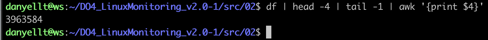

# Linux Monitoring 2.0
### by danyellt

#### Перед началом проверки убедитесь, что выполнили следующий проброс портов:

4444:4444
9090:9090
3000:3000

## Part 1. Генератор файлов

1. Написать bash-скрипт. Скрипт запускается с 6 параметрами. Пример запуска скрипта: 
```main.sh /opt/test 4 az 5 az.az 3kb```

**Параметр 1** - это абсолютный путь. 
**Параметр 2** - количество вложенных папок. 
**Параметр 3** - список букв английского алфавита, используемый в названии папок (не более 7 знаков). 
**Параметр 4** - количество файлов в каждой созданной папке. 
**Параметр 5** - список букв английского алфавита, используемый в имени файла и расширении (не более 7 знаков для имени, не более 3 знаков для расширения). 
**Параметр 6** - размер файлов (в килобайтах, но не более 100).

2. Выполнение скрипта:


## Part 2. Засорение файловой системы

1. Написать bash-скрипт. Скрипт запускается с 3 параметрами. Пример запуска скрипта: 
```main.sh az az.az 3Mb```

**Параметр 1** - список букв английского алфавита, используемый в названии папок (не более 7 знаков). 
**Параметр 2** - список букв английского алфавита, используемый в имени файла и расширении (не более 7 знаков для имени, не более 3 знаков для расширения). 
**Параметр 3** - размер файла (в Мегабайтах, но не более 100).

2. Свободная память в килобайтах до выполнения скрипта:



3. Выполнение скрипта:


4. Свободная память в килобайтах после выполнения скрипта:


5. Логфайл


## Part 3. Очистка файловой системы

1. Написать bash-скрипт. Скрипт запускается с 1 параметром.
Скрипт должен уметь очистить систему от созданных в Part 2 папок и файлов 3 способами:
По лог файлу
По дате и времени создания
По маске имени (т.е. символы, нижнее подчёркивание и дата).

2. Запуск скрипта по первому методу:


3. Запуск скрипты по второму методу:


4. Запуск скрипта по третьему методу:


5. Свободная память в килобайтах после выполнения скрипта:


## Part 4. Генератор логов

1. Написать bash-скрипт или программу на Си, генерирующий 5 файлов логов nginx в combined формате.
Каждый лог должен содержать информацию за 1 день.
За день должно быть сгенерировано случайное число записей от 100 до 1000.
Для каждой записи должны случайным образом генерироваться:

IP (любые корректные, т.е. не должно быть ip вида 999.111.777.777)
Коды ответа (200, 201, 400, 401, 403, 404, 500, 501, 502, 503)
Методы (GET, POST, PUT, PATCH, DELETE)
Даты (в рамках заданного дня лога, должны идти по увеличению)
URL запроса агента
Агенты (Mozilla, Google Chrome, Opera, Safari, Internet Explorer, Microsoft Edge, Crawler and bot, Library and net tool)

2. Выполнение скрипта


3. Логфайлы


## Part 5. Мониторинг

1. Написать bash-скрипт для разбора логов nginx из Части 4 через awk.
Скрипт запускается с 1 параметром, который принимает значение 1, 2, 3 или 4.
В зависимости от значения параметра вывести:

*1*) Все записи, отсортированные по коду ответа
*2)* Все уникальные IP, встречающиеся в записях
*3)* Все запросы с ошибками (код ответа - 4хх или 5хх)
*4)* Все уникальные IP, которые встречаются среди ошибочных запросов

2. Запуск скрипта с параметром 1


3. Запуск скрипта с параметром 2


4. Запуск скрипта с параметром 3


5. Запуск скрипта с параметром 4


## Part 6. GoAccess

1. С помощью утилиты GoAccess получить ту же информацию, что и в Части 5
Открыть веб интерфейс утилиты на локальной машине.

2. Устанавливаем необходимые утилиты скриптом installResources.sh


3. Запуск скрипта


4. Веб-интерфейс


## Part 7. Prometheus и Grafana

1. Установить и настроить Prometheus и Grafana на виртуальную машину


2. Получить доступ к веб интерфейсам Prometheus и Grafana с локальной машины


Указали Prometheus как источник данных для Grafana


3. Добавить на дашборд Grafana отображение ЦПУ, доступной оперативной памяти, свободное место и кол-во операций ввода/вывода на жестком диске


4. Запустить ваш bash-скрипт из Части 2


5. Посмотреть на нагрузку жесткого диска (место на диске и операции чтения/записи)


6. Установить утилиту stress и запустить команду stress -c 2 -i 1 -m 1 --vm-bytes 32M -t 10s


7. Посмотреть на нагрузку жесткого диска, оперативной памяти и ЦПУ


## Part 8. Готовый дашборд

1. Установить готовый дашборд Node Exporter Quickstart and Dashboard с официального сайта Grafana Labs


2. Провести те же тесты, что и в Части 7

*1)* Скрипт из второй части


*2)* stress


3. Запустить ещё одну виртуальную машину, находящуюся в одной сети с текущей


4. Запустить тест нагрузки сети с помощью утилиты iperf3


5. Посмотреть на нагрузку сетевого интерфейса


## Part 9. Дополнительно. Свой node_exporter

1. Написать bash-скрипт или программу на Си, которая собирает информацию по базовым метрикам системы (ЦПУ, оперативная память, жесткий диск (объем)).
Скрипт или программа должна формировать html страничку по формату Prometheus, которую будет отдавать nginx. 
Саму страничку обновлять можно как внутри bash-скрипта или программы (в цикле), так и при помощи утилиты cron, но не чаще, чем раз в 3 секунды.

Файл installResources.sh, устанавливающий необходимые утилиты и создающий сервис для работы нашего Node Exporter в фоновом режиме


Файл SystemMetrics.sh, собирающий информацию о системе


Файл MyNodeExporter.sh, выводящий информацию в .html файл


2. Поменять конфигурационный файл Prometheus, чтобы он собирал информацию с созданной вами странички.

Файл конфигурации nginx:


Файл конфигурации Prometheus:


Страничка nginx:


Цель собирается:


3. Провести те же тесты, что и в Части 7

Спокойное состояние:


*1)* Скрипт из второй части


*2)* stress


